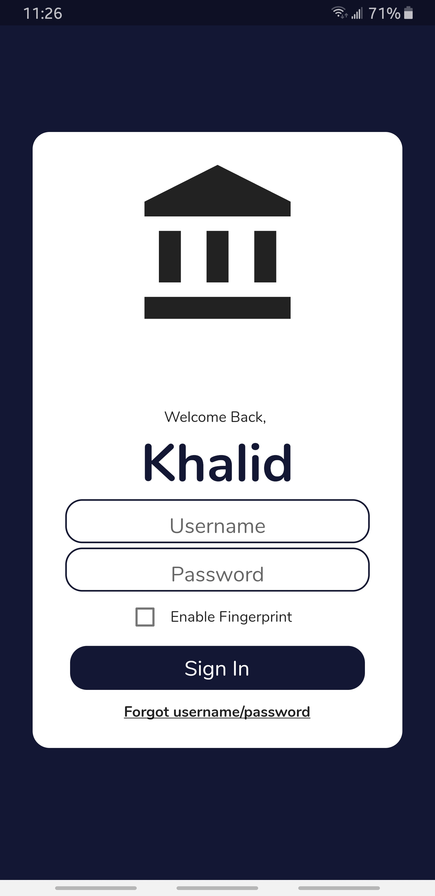
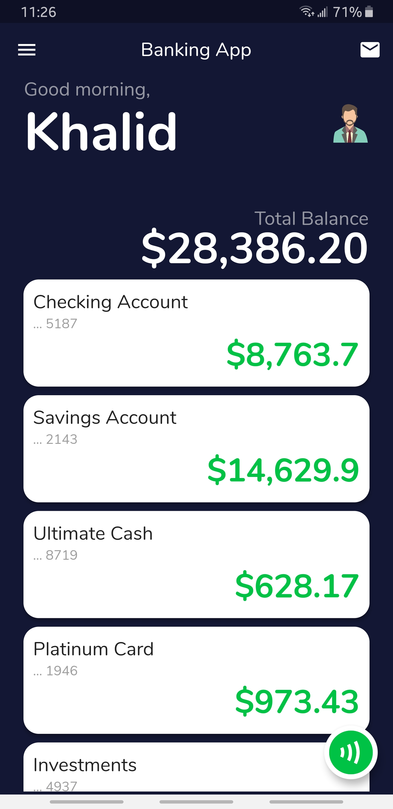
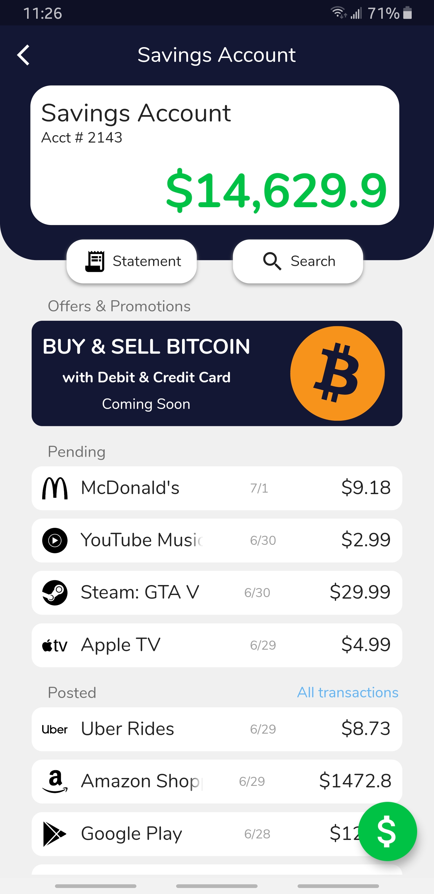
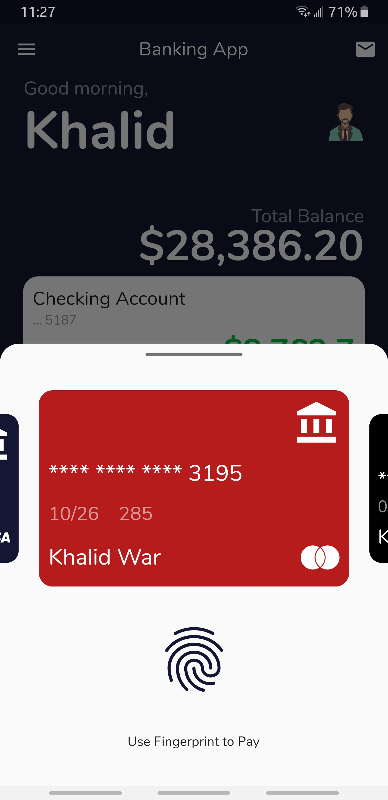
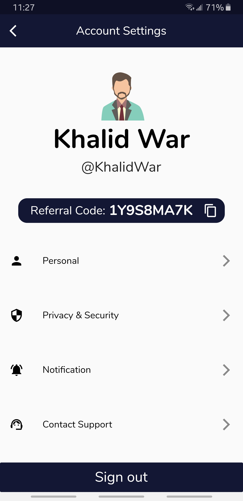

# Banking App
A beautifully designed banking app with login screen, home screen with total balance and accounts overview, and detailed individual account with pending and posted transactions. This app is built using [Flutter](https://flutter.dev) framework.

## Screenshots
     

## Packages used
- [Font Awesome Icons](https://pub.dev/packages/font_awesome_flutter)
- [Google Fonts](https://pub.dev/packages/google_fonts)
- [Flutter SVG](https://pub.dev/packages/flutter_svg)
- [Animations](https://pub.dev/packages/animations)
- [Carousel Slider](https://pub.dev/packages/carousel_slider)

## Installation
Install by either sideloading attacked [APK file](https://github.com/KhalidWar/banking_app/releases) on your android device or by building project from source following steps below.

### Getting Started
Check out [Flutter's official guide](https://flutter.dev/docs/get-started/install) to installing and running flutter

### Prerequisites
- Download IDE either [Android Studio](https://developer.android.com/studio) or [VSC](https://code.visualstudio.com/)
- Install Flutter SDK and Dart plugin
- Emulator or physical device

### Steps
- Clone this repo to your machine: `https://github.com/KhalidWar/banking_app.git`
- Run on Emulator or physical device
- All set!

## License
This project is licensed under [MIT Licnese](https://github.com/KhalidWar/banking_app/blob/master/LICENSE).

## Credit
- SVG images in this project have been obtained from [Simple Icons](https://simpleicons.org/)